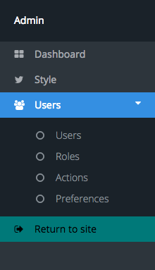
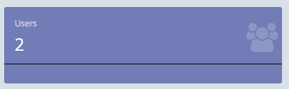

Extending Admin
===============
When building a NukaCode package, you may have additional details you would like to add to the admin area.  This is all
fairly easy.

Routes
--------
Set up your admin routes in your ``src/routes.php``.  While not all installs of your package will use this, it is still
good documentation for where the logic is.

Views
-------
Add your views to the src dir.  Depending on what framework you write them in, add them to ``src/views/framework/``.  Example:
if you are writing your views for twitter bootstrap, the directory would be ``src/views/bootstrap``.

admin.json
----------
The most important part of all of this is the json file.  Here is the admin.json from the users package.

.. code:: JSON

    {
        "navigation": {
            "Users": {
                "name": "Users",
                "icon": "fa fa-users",
                "route": "home",
                "children": [
                    "admin.user.user.*",
                    "admin.user.role.*",
                    "admin.user.action.*",
                    "admin.user.preference.*"
                ],
                "subSections": [
                    {
                        "name": "Users",
                        "route": "admin.user.user.index",
                        "children": [
                            "admin.user.user.*"
                        ]
                    },
                    {
                        "name": "Roles",
                        "route": "admin.user.role.index",
                        "children": [
                            "admin.user.role.*"
                        ]
                    },
                    {
                        "name": "Actions",
                        "route": "admin.user.action.index",
                        "children": [
                            "admin.user.action.*"
                        ]
                    },
                    {
                        "name": "Preferences",
                        "route": "admin.user.preference.index",
                        "children": [
                            "admin.user.preference.*"
                        ]
                    }
                ]
            }
        },
        "notifications": [
            {
                "color": "purple",
                "title": "Users",
                "focus": {
                    "method": "User::count",
                    "argument": "*"
                },
                "icon": "fa-users",
                "size": 3,
                "bar": "bar-inverse"
            }
        ]
    }

You will notice that the file is broken up into 2 main sections: navigation and notifications.

Navigation
----------

The navigation section should contain an object for each area you will be adding.  The above example creates one link in
the sidebar: "Users".

- name: The name that will be displayed for the link.
- icon: An icon that will appear before the text.  (optional)
- route: The route the link will point to to load the page.
- children: Any links within this section that should cause this link to still be considered active.
    - Generally, this is a combination of any links in the subsections.
    - Wildcards are allowed.

SubSection
~~~~~~~~~~
If SubSection is present, the link will become a drop down.  At that point, each object in here will be a link in the drop down.

- name: The name that will be displayed for the link.
- route: The route the link will point to to load the page.
- children: Any links within this section that should cause this link to still be considered active.
    - Wildcards are allowed.

.. note:: If SubSection is set, the initial link will become text and not link to anything.

Notifications
-------------

Notifications are used on the admin dashboard.  They can display quick, at-a-glance information from the package.

- color: This can be any of the colors allowed by the theme.  (teal, blue, aqua, purple, black, orange, red, radiation, green)
- title: The title at the top of the box.
- focus: The primary text that is the most prominent.
- icon: The icon that will appear on the right side of the box.
- size: The number of columns the notification should take up.
- bar: The color of the horizontal bar.  (bar or bar-inverse)

Focus
~~~~~~~
Focus is a unique entry in these.  It can be a string, or an object accepting two parameters.

- method: A method to be called.
- argument: Any argument to be passed to that method.

Admin will take these can call ``call_user_func(<method>, <argument>)``.  Test to make sure your focus works with this call
and it will work as a notification.